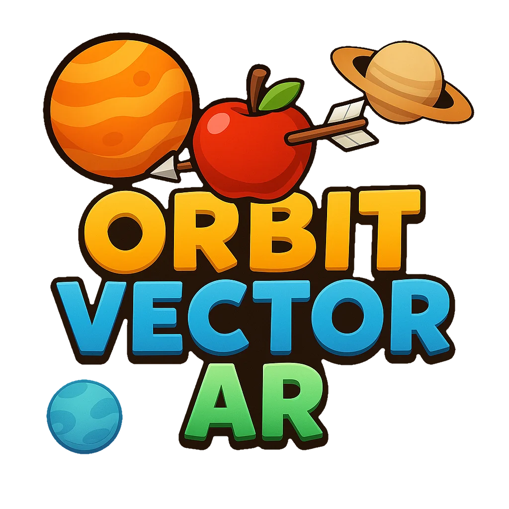
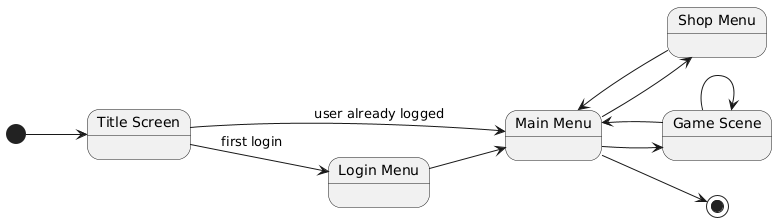
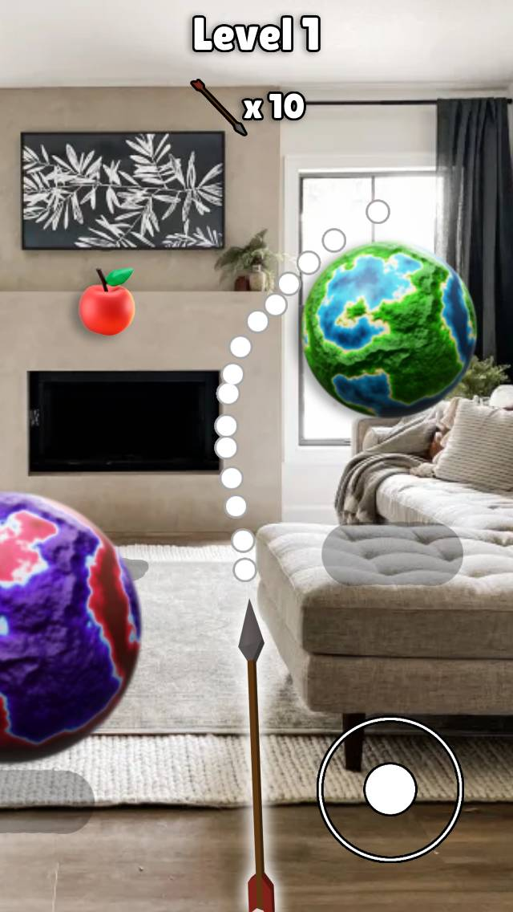

<h1>Cahier des Charges – Orbit Vector AR</h1>

**Auteurs** BEAUJARD Traïan, RAMALLO Alex - **Date** 29/04/2025 - **Version** 1.0.1

- [1. Introduction](#1-introduction)
- [2. Objectifs](#2-objectifs)
  - [2.1 Objectifs du projet](#21-objectifs-du-projet)
    - [2.2 Objectifs Principaux](#22-objectifs-principaux)
    - [2.3 Objectifs Secondaires](#23-objectifs-secondaires)
- [3. Analyse centrée utilisateur](#3-analyse-centrée-utilisateur)
  - [3.1 Personas](#31-personas)
  - [3.2 Scénarios d'utilisation](#32-scénarios-dutilisation)
- [4. Exigences fonctionnelles](#4-exigences-fonctionnelles)
  - [4.1 Cœur du Gameplay "Core"](#41-cœur-du-gameplay-core)
  - [4.2 Réalité Augmentée](#42-réalité-augmentée)
  - [4.3 Génération Procédurale des Niveaux](#43-génération-procédurale-des-niveaux)
  - [4.4 Système de Contrôle](#44-système-de-contrôle)
  - [4.5 Système de Score](#45-système-de-score)
  - [4.6 Gestion des Ressources (Flèches)](#46-gestion-des-ressources-flèches)
  - [4.7 Conditions de Victoire et de Défaite](#47-conditions-de-victoire-et-de-défaite)
  - [4.8 Économie Interne (Pièces)](#48-économie-interne-pièces)
  - [4.9 Leaderboard](#49-leaderboard)
  - [4.10 Authentification Utilisateur](#410-authentification-utilisateur)
- [5. Interfaces utilisateur](#5-interfaces-utilisateur)
  - [5.1 Objectifs](#51-objectifs)
  - [5.2 Les menus et la navigation](#52-les-menus-et-la-navigation)
  - [5.3 Prototype de la scène de jeu](#53-prototype-de-la-scène-de-jeu)
- [6. Spécifications techniques](#6-spécifications-techniques)
  - [6.1 Outils de développement](#61-outils-de-développement)
    - [6.1.1 Outils de programmation](#611-outils-de-programmation)
    - [6.1.2 Outils de conception](#612-outils-de-conception)
  - [6.2 Matériel](#62-matériel)
- [7. Plan de travail](#7-plan-de-travail)

## 1. Introduction

Nous proposons de développer un jeu mobile sur Android en réalité augmentée. Le jeu est un jeu de puzzle où le joueur doit tirer des flèches sur des cibles en utilisant la gravité des planètes procéduralement placées dans le décor réel. 

## 2. Objectifs
### 2.1 Objectifs du projet

Le but de ce projet est d'avoir un jeu créant une expérience unique et originale.

#### 2.2 Objectifs Principaux
- Développer un jeu mobile sur Android utilisant la Réalité Augmentée. 
  - L'application doit détecter les surfaces de l'environnement réel et y ancrer des éléments du jeu.
- Implémenter un gameplay de puzzle basé sur la physique.
  -  Le joueur doit lancer des flèches dont la trajectoire est influencée par l'attraction gravitationnelle de planètes pour atteindre la cible.
- Intégrer une génération procédurale des niveaux.
  -  Les niveaux (position, nombre des planètes, de la cible) doivent être générés procéduralement en fonction de l'environnement détecté.
- Réaliser une interface utilisateur (UI) intuitive et adaptée au contexte d'un jeu mobile et de l'AR.

#### 2.3 Objectifs Secondaires
- Mettre en place un système de score et de classement multijoueur.
  - Le score de chaque joueur est sauvegardé en ligne.
  - Permettre aux joueurs de comparer leurs scores.
- Développer un système monétaire et de personnalisation. 
  - Offrir aux joueurs la possibilité d'acheter des skins (flèches, planètes, cibles) avec une monnaie gagnée à chaque partie.

## 3. Analyse centrée utilisateur

### 3.1 Personas

Voir projet personnas *(powerpoint)* [ici](https://utbm-my.sharepoint.com/:p:/g/personal/traian_beaujard_utbm_fr/EfwHXCU6JulKsMv6bCm5jg0BrzGHbsWQG08oOuYsqQJGIA?e=Gw7FAO).
  
### 3.2 Scénarios d'utilisation
Voir projet scénarios *(powerpoint)* [ici](https://utbm-my.sharepoint.com/:p:/g/personal/traian_beaujard_utbm_fr/EQRIgrvpSblNs-On_Nu7bM0B8ksACpy1QWDIH7FZ6Lmtkw?e=afNBla).

## 4. Exigences fonctionnelles

### 4.1 Cœur du Gameplay "Core"
- Le jeu doit permettre au joueur de lancer des projectiles depuis une position fixe.
  - Les flèches doivent suivre une trajectoire influencée par :
      - Paramètres de lancement de la flèche.
      - L'attraction gravitationnelle simulée des objets placés dans le niveau.
- Le but de chaque niveau est de toucher une cible spécifique avec une flèche.
- Le joueur dispose d'un nombre limité de flèches par niveau.
  - Le jeu affiche un écran de fin quand le joueur n'a plus de flèches. Puis retourne au menu principal créant la boucle de jeu.

### 4.2 Réalité Augmentée
- L'application doit :
    - Détecter les surfaces planes horizontales dans l'environnement réel de l'utilisateur.
    - Afficher les éléments virtuels du jeu (planètes, flèche de visée, cible, trajectoire prédictive ?) de manière stable par rapport à l'environnement réel.
- L'application doit gérer les conditions de tracking AR (Progression cartographie, ...).

### 4.3 Génération Procédurale des Niveaux
- L'application doit générer procéduralement la disposition des planètes (nombre, position, masse/taille) et de la cible pour chaque nouveau niveau.
- La difficulté des niveaux doit augmenter progressivement.
- L'algorithme de génération doit s'assurer que chaque niveau généré est solvable.

### 4.4 Système de Contrôle
- Le joueur doit pouvoir contrôler la direction et la force de tir de la flèche.

### 4.5 Système de Score
- Le joueur gagne des points à chaque niveau réussi.
- Le score du joueur est sauegardé en ligne à la fin de chaque session de jeu.

### 4.6 Gestion des Ressources (Flèches)
- Le joueur commence une session avec un nombre défini de flèches.
- Chaque tir consomme une flèche.
- Le joueur gagne des flèches à chaque niveau réussi.

 

### 4.7 Conditions de Victoire et de Défaite
- Le jeu se termine lorsque le joueur n'a plus de flèches.

### 4.8 Économie Interne (Pièces)
- À la fin d'une session de jeu, le score est converti en Pièces (formule à définir).
- Le joueur peut utiliser les Pièces pour acheter des skins cosmétiques (flèches, cibles, planètes).
  - Chaque item doit avoir un coût en Pièces.
  - Le joueur doit pouvoir acheter des items s'il possède assez de pièces.
  - Le joueur doit pouvoir équiper/déséquiper les skins possédés.

### 4.9 Leaderboard
- L'application doit intégrer un classement des meilleurs scores.
- Le classement doit être accessible depuis le menu principal.
- Il doit afficher le pseudo du joueur et son score.

### 4.10 Authentification Utilisateur
- L'application permet à l'utilisateur de s'authentifier via son uiid et un pseudo.

## 5. Interfaces utilisateur

### 5.1 Objectifs
- Cohérence : Maintenir un style visuel à travers tous les menus.
- Simplicité : Éviter la surcharge d'informations, privilégier des indications visuelles, claires et intuitives.
- Feedback : Fournir des retours visuels et sonores lors des interactions.
- Adaptation AR : Concevoir une interface ergonomique malgré les contraintes de la réalité augmentée.

### 5.2 Les menus et la navigation

 

### 5.3 Prototype de la scène de jeu

## 6. Spécifications techniques

### 6.1 Outils de développement
#### 6.1.1 Outils de programmation
- Plateforme : Android
- Langage : Kotlin
- Framework : ARCore
- Base de données : MySQL
- API : PHP
- Versioning : GitHub
- IDE : Android Studio/Visual Studio Code
- Assistant de développement : Github Copilot

#### 6.1.2 Outils de conception
- Logiciel modélisation 3D : Blender
- Logiciel graphique : Photopea
  
### 6.2 Matériel
- Le serveur sera hébergé sur une raspiberry pi 4b sous Ubuntu Server.

## 7. Plan de travail

Faut faire cours je crois que j'ai dépassé les 2 pages