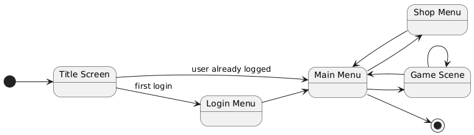
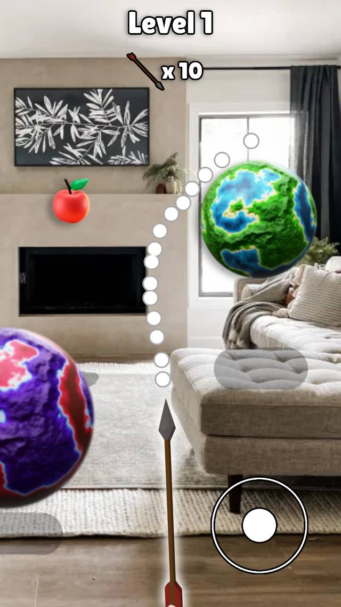

#  Game Design Document (GDD) for ""

The game is an AR android game where the player use their phone to launch arrows to hit apples through procedural generated level based on the user environent where planets are placed and have a 3d physic attraction to deflect the arrows.

# Game Overview

## Genre 
- Puzzle/Arcade
- AR (Augmented Reality)

## 3Cs 
- **Character**: The phone is pointing the arrow.
- **Control**: 
  - The player uses the phone to aim and shoot arrows at apples. 
  - Joystick 
    - Left/Right : control the arrow direction.
    - Up/Down : control the arrow speed/force.
  - Slider 
    - Change the arrow mass.
  - The Player can't move too much, the game is played in a fixed position.
- **Camera**: The camera is the phone camera.

## Game Core

- The game is a succession of puzzle levels incrasingly difficult. Difficulty is the sum of the number of planets. 
- The player has a total of X arrows, each level he wins some arrows.
- Each levels player wins points for his score.
- Score is saved at the end to an online leaderboard.
  
## Victory Conditions
- Hit the apple with the arrow.

## Defeat Conditions
- When the player has no more arrows.

## Currencies
- The player has a score, which is converted to coins at the end of his game.
- The player can use coins to buy skins for the arrows, skins for the apples, skins for the planets.

## Replayability
- The game is replayable because the levels are procedurally generated.
- The game is replayable because the player can try to beat his score.
- The game is replayable because the player can try to beat the leaderboard.

## Monetization
- The game is free to play.
- The game use in-app purchases to buy cosmetics (skins for the arrows, skins for the apples, skins for the planets).

# UI

## Navigation

## Screens

### Title Screen

2 Choices to that we have to choose from:

    
    

- **Left image:** Title Screen with AR background using ARCore.
- **Right image:** Title Screen with custom game-themed background (example) using Jetpack Compose.

The Game Title will be made on Photoshop.

### Login Screen

→ Custom loging with SQL or we can use Google Play Services to login with the Google account. 
  - Google play services is easier, and the standard way to login in Android games.
  - SQL might be more interesting to implemant with a server using php apis, but it is not the standard way to login in Android games.

### Menu Screen

### Shop Screen

→ We might want to add real In App Purchases to buy coins, and special packs with Google IAP service.

### Game 

#### Playing

#### Victory

#### Game Over

