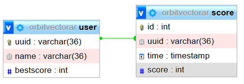

<!-- .slide: data-background="./background.png" -->

# Orbit Vector

---

### Perrin Antoine, Beaujard Traïan, Martin, Alex
#### SY43 - P25

/s

## Introduction

- Why this subject ?

/s

# UI

## UI Slide 1

/v

## UI Slide 2

/v

## UI Slide 3

/s

# Base de Données

/v

## Structure de la Base de Données

### Table USER
- **uuid** (Primary Key) : Identifiant unique de l'utilisateur
- **name** : Nom de l'utilisateur
- **bestscore** : Meilleur score de l'utilisateur

/v

### Table SCORE
- **id** (Primary Key) : Identifiant unique du score
- **uuid** (Foreign Key) : Référence vers l'utilisateur
- **time** : Date et heure du score
- **score** : Valeur du score

/v

## Relations
- Un utilisateur peut avoir plusieurs scores (1:N)
- Chaque score appartient à un seul utilisateur
- La clé étrangère uuid dans SCORE référence la clé primaire de USER

/v

## MCD

/s

# Gameplay

## Gameplay Slide 1

/v

## Gameplay Slide 2

/v

## Gameplay Slide 3