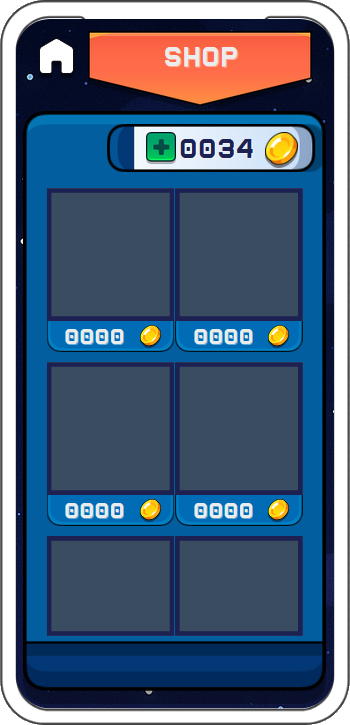

<!-- .slide: data-background="./img/background.png" style="color:white-->


---

<h3 style="color:white">
Perrin Antoine, Beaujard Traïan, Martin, Alex  
</h3>

<h4 style="color:white">
SY43 - P25
</h4>

/s

## Contextualisation du projet

### Jeu casual Puzzle en AR : Orbit Vector AR

<div style="display: flex; justify-content: center; align-items: flex-start; gap: 2vw;">
  <div style=" line-height: 1.2;">
    <ul>
      <li>Atteindre la cible (pomme) avec une flèche</li>
      <li>Utiliser la gravité des planètes pour dévier la flèche</li>
      <li>Partie finie quand plus de flèches</li>
      <li>Score sauvegardé en ligne sur BDD</li>
      <li>Classement en ligne</li>
    </ul>
  </div>

  
</div>

/vs

### Avancée globale


/s
# UI

/vs

## Les visuels à atteindres 
<div style="display: flex; justify-content: center; align-items: flex-start; gap: 2vw; flex-wrap: wrap;">
  
  
  
</div>

/vs

<div style="display: flex; justify-content: center; align-items: flex-start; gap: 2vw; flex-wrap: wrap;">

  
  
  
</div>

/vs

## Ce que nous avons 

<div style="display: flex; justify-content: center; align-items: flex-start; gap: 2vw; flex-wrap: wrap;">
  
  
  
</div>

/vs

<div style="display: flex; justify-content: center; align-items: flex-start; gap: 2vw; flex-wrap: wrap;">

  
  
  
</div>

/vs

## Ce qu'il nous reste à faire 

-  Relier l'UI avec la base de donnée
-  Faire correspondre les visuels attendu avec l'UI existante

/s

# Base de Données
/vs

## Structure de la Base de Données

### Table USER
- **uuid** (Primary Key) : Identifiant unique de l'utilisateur
- **name** : Nom de l'utilisateur
- **bestscore** : Meilleur score de l'utilisateur

/vs

### Table SCORE
- **id** (Primary Key) : Identifiant unique du score
- **uuid** (Foreign Key) : Référence vers l'utilisateur
- **time** : Date et heure du score
- **score** : Valeur du score

/vs

## Relations
- Un utilisateur peut avoir plusieurs scores (1:N)
- Chaque score appartient à un seul utilisateur
- La clé étrangère uuid dans SCORE référence la clé primaire de USER

/vs

## MCD


/s

### Connection entre Kotlin et Base de Données

### API PHP

- Utilisation du site hébergé par Traïan : [OrbitVectorAPI](http://chaelpixserver.ddns.net/apis/ovar/)
- Le PHP interagit avec la base de données MySQL
- Les requêtes sont envoyées via des appels HTTP GET

/vs

## PHP -> Kotlin

- Utilisation de la bibliothèque Retrofit pour les appels HTTP
- Les réponses sont traitées en JSON
- Les données sont envoyées sous forme de paramètres d'URL (GET pour des requêtes simples)
- Les réponses sont transformées en objets Kotlin facilement manipulables
- Exemple de requête : `http://chaelpixserver.ddns.net/apis/ovar/register.php?uuid=1234&username=JohnDoe

/vs

### Endpoints PHP

<div style="text-align: center; transform: translateX(-5%);">
    <table style="font-size: 0.8em;">
        <thead>
            <tr>
                <th>Endpoint</th>
                <th>Méthode</th>
                <th>Paramètres</th>
                <th>Réponse</th>
            </tr>
        </thead>
        <tbody>
            <tr>
                <td>register.php</td>
                <td>GET</td>
                <td>uuid, username</td>
                <td>"REGISTERED:{UUID}"</td>
            </tr>
            <tr>
                <td>login.php</td>
                <td>GET</td>
                <td>uuid</td>
                <td>"GOOD"/"UNKNOWN_UUID"</td>
            </tr>
            <tr>
                <td>send_score.php</td>
                <td>GET</td>
                <td>uuid, score</td>
                <td>"SCORE_ADDED"/"FAIL"</td>
            </tr>
            <tr>
                <td>get_global_scores.php</td>
                <td>GET</td>
                <td>-</td>
                <td>JSON scores</td>
            </tr>
            <tr>
                <td>get_user_scores.php</td>
                <td>GET</td>
                <td>uuid</td>
                <td>JSON scores</td>
            </tr>
        </tbody>
    </table>
</div>


/vs

### Exemple Code API

`ApiService.kt`

```kotlin [30:]
@GET("get_user_scores.php")
    suspend fun getUserScores(
        @Query("uuid") uuid: String,
        @Query("limit") limit: Int? = null,
        @Query("order") order: String = "DESC",
        @Query("param") param: String = "score"
    ): Response<List<UserScore>>
```

/vs

### Utilisation de l'API dans le code Kotlin
`MainViewModel.kt`
```kotlin [191:]
else if (_uiState.value.isLoggedIn) {
    val response = api.getUserScores(_uiState.value.uuid)
    Log.d(TAG, "User scores response: ${response.body()}")
    
    if (response.isSuccessful) {
        _uiState.value = _uiState.value.copy(
            userScores = response.body() ?: emptyList(),
            lastErrorMessage = null
        )
    }
    [...]
}

```

/vs

### Résultat JSON

```json
[
  {
    "score": 1000,
    "time": "2025-05-08 16:21:51"
  },
  {
    "score": 500,
    "time": "2025-05-08 16:21:58"
  },
  {
    "score": 300,
    "time": "2025-05-08 16:22:01"
  }
]
```

/s

# Gameplay AR
<br>


/vs

## AR Core

<div style="font-size: 1.5vw; line-height: 1.5;">

-  [AR Core](https://developers.google.com/ar) est un SDK offrant des fonctionnalités de réalité augmentée pour Android utilisable par APIs Kotlin.
  
<br> 
<br> 

### Fonctionnalités utiles d'AR Core
<div style="font-size: 1.8vw; line-height: 1.2;">
<ul>
  <li>Caméra</li>
  <li>Suivi de mouvement (position et orientation)</li>
  <li>Cartographie de l'environnement</li>
  <li>Estimation de la lumière ambiante</li>
  <li>Détection de surfaces planes</li>
  <li>Depth Map</li>
  <li>Ancrage d'objets virtuels dans le monde réel</li>
</ul>
</div>
</div>

/vs
---

Mis en place l'exemple d'AR Core, testé les apis. Puis crée un repo template github pour notre projet;


/vs

<div style="display: flex; justify-content: center; align-items: flex-start; gap: 2vw;">
  
    
  
</div>
 
/vs

## Ce qui a été fait

<div style="font-size: 2vw; line-height: 1.2;">
<ul>
  <li>Placement de la Pomme (cible)</li>
  <li>Lancement de la flèche (physiques)</li>
  <li>Création et placement des planètes (+ physiques)</li>
  <li>Gestion des colisions et intéractions entre les objets</li>
  <li>Gestion des flèches, scores, boucle de jeu</li>
  <li>Générateur de niveau procédural</li>
  <li>Prévisualisation 3d de la trajectoire</li>
  <li>Implémenté les modèles 3D et textures</li>
</ul>
</div>
/vs

### Placement des objets

<div style="font-size: 1.5vw; line-height: 1.5;">
<ul>
  <li>Un algorithme de placement procédural positionne chaque planète et la pomme autour d'une origine (l'ancre AR) selon les variables de génération.</li>
  <li>Le placement varie à chaque niveau.</li>
  <li>La logique de génération vérifie la distance minimale entre chaque objet, et entre l'utilisateur et l'ancre.</li>
</ul>
</div>

<b>Instanciation des objets 3D</b>

<div style="font-size: 1.1vw; margin-left: 2vw;">

`onDrawFrame()` gère l'affichage de tous les objets 3D dans la scène AR. C'est une boucle de rendu qui s'exécute à chaque frame.

Les modèles 3D et textures au démarrage :


```kotlin
val appleMesh = Mesh.createFromAsset(render, "models/apple.obj")
val appleTexture = Texture.createFromAsset(render, "models/textures/apple_texture.jpg")
```
</div>

/vs

<div style="font-size: 1.1vw; margin-left: 2vw;">


Position et échelle sont calculées pour chaque objet via une matrice de transformation :

```kotlin
Matrix.setIdentityM(modelMatrix, 0)
Matrix.translateM(modelMatrix, 0, planet.worldPosition[0], planet.worldPosition[1], planet.worldPosition[2])
Matrix.scaleM(modelMatrix, 0, scale, scale, scale)
```

Puis le mesh et la texture sont appliqués :

```kotlin
virtualObjectShader.setMat4("u_ModelView", modelViewMatrix)
virtualObjectShader.setMat4("u_ModelViewProjection", modelViewProjectionMatrix)
virtualObjectShader.setTexture("u_AlbedoTexture", planetTextures[planet.textureIdx])
render.draw(planetMesh, virtualObjectShader, virtualSceneFramebuffer)
```

</div>

/vs

#### Système d'ancrage

<div style="font-size: 1.5vw; line-height: 1.5;">
<ul>
  <li>L'ancre AR sert de point de référence. Sa position est calculée selon la distance avec la caméra et reste ancré dans l'espace via ARCore.</li>
  <li>Une fois le tracking stable, l'ancre est placée à une position précise.</li>
  <li>Tous les placements d'objets sont relatives à cette ancre, simplifiant la gestion spatiale.</li>
</ul>
</div>

<div style="font-size: 1.5vw; margin-left: 2vw;">

**Position de l'ancre dans le monde**
</div>


<div style="font-size: 1.1vw; margin-left: 2vw;">
$$
\text{anchorWorld} = \text{cameraPose} \times \text{TranVeslation}(0,\,1.5,\, -3.5)
$$
</div>

/vs

<div style="font-size: 1.5vw; margin-left: 2vw;">

**Génération d'une position locale autour de l'ancre**
</div>

<div style="font-size: 1.5vw; margin-left: 2vw; ">

$ r \in [0, r_{max}] $  
$ \theta \in [0, 2\pi] $  
$ \phi \in \left[-\frac{\pi}{2} \cdot s, \frac{\pi}{2} \cdot s\right] $  

$ x = r \cdot \cos\theta \cdot \cos\phi $  
$ y = r \cdot \sin\phi $  
$ z = r \cdot \sin\theta \cdot \cos\phi $  

$ \text{worldPos} = \text{anchorPose} \times (x, y, z) $

$r$ est la distance aléatoire entre l'ancre et l'objet <br>
$ \theta $ est l'angle aléatoire autour de l'ancre (horizontal) <br>
$ \phi $ est l'angle aléatoire autour de l'ancre (vertical) <br>

</div>

/vs

<div style="display: flex; justify-content: center; align-items: flex-start; gap: 2vw;">
  
  
</div>
 
/vs

#### Ajout des modèles et textures

<div style="font-size: 1.5vw; line-height: 1.5;">
<ul>
  <li>Les modèles 3D (.obj) et textures sont importés et gérés dans le code pour chaque objet.</li>
</ul>
</div>

<br>
<div style="font-size: 1.5vw; margin-left: 2vw;">

**Exemple**

```kotlin
val planetMesh = Mesh.createFromAsset(render, "models/apple.obj")
val planetTexture = Texture.createFromAsset(render, "models/textures/apple_texture.jpg")
```
</div>

/vs

<div style="display: flex; justify-content: center; align-items: flex-start; gap: 2vw;">
  
  
</div>

/vs

### Physiques - Gravité et Attraction

<div style="font-size: 1.5vw; line-height: 1.5;">
<ul>
  <li>La gravité est simulée : chaque planète attire la flèche avec une version adaptée de la loi de Newton.</li>
</ul>
</div>

<br>

<div style="font-size: 1.5vw; margin-left: 2vw;">

**Formule utilisée :**

$$
\vec{F} = G \cdot \frac{m_1 \cdot m_2}{\max(r^2, r_{min}^2) + \varepsilon} \cdot \vec{u}
$$

<ul style="font-size: 1vw; margin-left: 2vw;">
  <li><b>G</b> : constante de gravité (ajustée pour le jeu)</li>
  <li><b>m₁, m₂</b> : masses des objets</li>
  <li><b>r</b> : distance entre les centres</li>
  <li><b>r min</b> : rayon minimal (rayon de la planète)</li>
  <li><b>ε</b> : éviter la division par zéro</li>
  <li><b>u</b> : vecteur direction planète → flèche</li>
</ul>
</div>

/vs

#### Physique des flèches

<div style="font-size: 1.5vw; line-height: 1.5;">
<ul>
  <li>À chaque frame, la position et la vélocité de la flèche sont mises à jour.</li>
</ul>
</div>

<br>

<div style="font-size: 1.4vw; margin-left: 2vw;">

```kotlin
//dist fleche - planete
val dx = planet.worldPosition[0] - arrow.position[0]
val dy = planet.worldPosition[1] - arrow.position[1]
val dz = planet.worldPosition[2] - arrow.position[2]
var distSq = dx*dx + dy*dy + dz*dz
if (distSq < (planet.targetRadius * 0.5f).pow(2)) { distSq = (planet.targetRadius * 0.5f).pow(2) }
distSq += 0.01f //epsilon
val dist = sqrt(distSq)
//force
val forceMagnitude = gravityConstant * planet.mass * arrow.mass / distSq 
//update la velocite
arrow.velocity[0] += forceMagnitude * dx / dist * dt
arrow.velocity[1] += forceMagnitude * dy / dist * dt
arrow.velocity[2] += forceMagnitude * dz / dist * dt
```
</div>

/vs

<div style="font-size: 1.5vw; line-height: 1.5;">
<ul>
  <li>La position par rapport à la pomme (cible) est calculée pour détecter la colision.</li>
</ul>
</div>

<div style="font-size: 1.4vw; margin-left: 2vw;">

```kotlin
val collisionDistanceSq = (ARROW_VISUAL_AND_COLLISION_RADIUS + currentApple.targetRadius).pow(2)
if (calculateDistanceSquared(arrow.position, currentApple.worldPosition) < collisionDistanceSq) {
    // Collision avec la pomme
    Log.i(TAG, "Apple hit!")
    gameState.score += 100 * gameState.level
    gameState.state = PuzzleState.VICTORY
    arrow.active = false
    return
}
```
</div>

/vs

<video controls width="250">
    <source src="img/ar_screens/arrow1.mp4" type="video/mp4">
    Sorry, your browser doesn't support embedded videos.
</video>
<video controls width="250">
    <source src="img/ar_screens/arrow2.mp4" type="video/mp4">
    Sorry, your browser doesn't support embedded videos.
</video>
/vs

#### Prévisualisation trajectoire de la flèche


<div style="font-size: 1.5vw; line-height: 1.5;">
<ul>
  <li>Toutes les 0.05s, le jeu simule le lancement d'une flèche, récupère les points à intervalles réguliers, et instancie des sphères le long de la courbe.</li>
</ul>
</div>

<video controls width="250">
    <source src="img/ar_screens/trajectory.mp4" type="video/mp4">
    Sorry, your browser doesn't support embedded videos.
</video>

/vs

### Générateur de niveaux procéduraux

<div style="font-size: 1.5vw; line-height: 1.5;">
<ul>
  <li>Un générateur procédural adapte à chaque niveau le nombre, la taille et la masse des planètes pour augmenter la difficulté.</li>
</ul>
</div>

<br>

<div style="font-size: 1.5vw; line-height: 1.5;">

**Exemples**
```kotlin
val clusterMaxRadiusPlanets = CLUSTER_MAX_RADIUS_PLANETS + (level * 0.12f).coerceAtMost(3.0f) 
val planetTargetRadiusMin = PLANET_TARGET_RADIUS_MIN + (level * 0.01f).coerceAtMost(0.25f)
val planetTargetRadiusMax = PLANET_TARGET_RADIUS_MAX + (level * 0.03f).coerceAtMost(1.2f)
val planetMassScale = PLANET_MASS_SCALE_FACTOR + (level * 400f)
val appleClusterRadius = CLUSTER_MAX_RADIUS_APPLE + (level * 0.03f).coerceAtMost(2.0f)
```
</div>

/vs

## Ce qui reste à faire 

<div style="font-size: 2vw; line-height: 1.2;">
<ul>
  <li>Envoyer les scores à la BDD</li>
  <li>Intégrer changement de menu JetpackCompose -> Scene AR</li>
  <li>Améliorations et équilibrages</li>
  <li>Publication sur Playstore</li>
</ul>

</div>

/s

## FIN